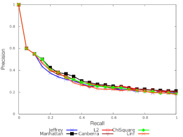

# ImageRank

This project brings many feature image extractors and distance functions to easily compare your dataset's features by generating a precision-recall curve.

All the image metadata, extractions, and query results are stored in a Postgres database, so you don't need to recalculate them every time a new extractor or distance function is introduced.
Let's say that this project aims to be an EQP (Extract-Query-Plot) tool.

By the way, this project is called ImageRank, but it's not specific to images, so you can the image extraction and store the features directly into the database.

## Explanation
A supervised learning-based Content-based image retrieval (CBIR) needs the following steps.

1. Have a test dataset of images and their classes—for example, multiple pictures of dogs separated by a particular breed.
2. We don't analyze the pixels but extract a derived vector from them.
The generated multi-dimensional vector is called a feature vector, and this process feature extraction.
The algorithm that transforms the image pixels into a vector is called feature extractor.
3. Calculate the proximity of one extracted feature previously with other vectors of the same class.
A distance function gives the proximity comparison, and the query could be a lazy k-NN query, i.e. find the k closest neighbours independent of the class. K-NN is a lazy learner (it doesn't learn from the previous results), while a neural network is an eager learner. This project only uses k-NN queries.
4. Based on the query results, check the effectiveness of the extractor or the distance function visually, comparing all of the available options. 
A precision-recall curve gives you the rate of false positives and false negatives.

## Initial motivation
Developed by me and [Pedro Tanaka](https://github.com/pedro-stanaka) for the digital signal processing course during our master's program.

The project was initially used to write a paper in which, given a dataset of lung X-Rays clustered by several diseases, we would compare if the [Wavelet](https://en.wikipedia.org/wiki/Wavelet) extractor was better than using traditional histograms extractors.

One thing led to another, and the abstraction bug bit us (typical "Can you pass the salt?" XKCD comic)
So, ImageRank yields the results of this paper in an automated fashion with no tight coupling to X-Rays, wavelets or any particular distance function.

The resulting paper is [here](./res/paper.pdf) (written in portuguese).
        
## Out-of-the-box extractors and distance functions
By default, there are dozens of image extractors available.
The lib [JWave](https://github.com/graetz23/JWave) implements the wavelet ones.
This project uses only the FastWaveletTransform with different levels, but it's easy to add new ones.
[JFeatureLib](https://github.com/locked-fg/JFeatureLib) provides other [generic extractors](https://github.com/locked-fg/JFeatureLib/tree/888d0d9f36381624cef28165bf19c0af022a10d1/src/main/java/de/lmu/ifi/dbs/jfeaturelib/features).

Some [distance functions](https://github.com/gjhenrique/ImageRank/tree/master/src/main/java/br/uel/mdd/metric/) such as Canberra and Euclidean are inside this project:

## Stages

## 0. Building the project
You need to have these installed:
- Java 8
- GNUPlot
- Maven
- Postgres

### Running tests
``` shell
# Use
export TEST_DB=imagerank_test
export JDBC_URL="jdbc:postgresql://localhost/$TEST_DB?user=postgres&password=postgres"

psql -U postgres -h localhost imagerank < sql/schema-creation.sql

# Run the tests
mvn test
```

### Assembling the project

``` shell
export DB=imagerank
export JDBC_URL="jdbc:postgresql://localhost/$DB?user=postgres&password=postgres"
# Run the schema
psql -U postgres -h localhost imagerank < sql/schema-creation.sql
# Load distance function and extractors metadata
psql -U postgres -h localhost imagerank < sql/seeds.sql

# Build a fat JAR with all the dependencies
# Skip tests, so you don't overwrite the database
mvn assembly:assembly -DskipTests
```

### 1. Persisting the images
We need to tag the dataset images into our database

By default, the directory is the name of the dataset, and the class is extracted from the name of the image.
In this example, there are three different classes Chihuahua, Groenendael and Saluki.

``` 
# Given the following layout
Dogs
├── Chihuahua_n02085620_199.jpg
├── Chihuahua_n02085620_242.jpg
├── Groenendael_n02105056_933.jpg
├── Groenendael_n02105056_961.jpg
└── Saluki_n02091831_97.jpg

java -jar target/image-wavelet-1.0-jar-with-dependencies.jar --image-extraction --images-path <path>
```
       
### 2. Feature extraction
Extracts the features from the images and saves the result into the `extractions` table.

``` shell
# Run all extractions. The time it takes is (extractors * number of images)
java -jar target/image-wavelet-1.0-jar-with-dependencies.jar --feature-extraction --all-extractors

# Run single extraction
java -jar target/image-wavelet-1.0-jar-with-dependencies.jar --feature-extraction --extractor-feature-id=1
java -jar target/image-wavelet-1.0-jar-with-dependencies.jar --feature-extraction --extractor-feature-id=100
```

Refer to the seeds file to get the [extractor id](https://github.com/gjhenrique/ImageRank/blob/3efaa5c2535a530fefbfca6636edc042ed53ee89/sql/seeds.sql#L2).

### 3. k-NNS queries
By default, the tool performs 20 queries ranging from `5-nn` to `100-nn`. This option can be configured by the `--rate-k` and `--max-k`

It might take a while to finish, even with a thread pool to parallelize the queries.
The cost for querying the whole database is `O(number of distance functions * number of extractions * rate of k)`

``` shell
java -jar target/image-wavelet-1.0-jar-with-dependencies.jar --knn-queries --all-extractions --all-distance-functions
java -jar target/image-wavelet-1.0-jar-with-dependencies.jar --knn-queries --extractor-query-id=100 --all-distance-functions
java -jar target/image-wavelet-1.0-jar-with-dependencies.jar --knn-queries --extractor-query-id=100 --distance-function-id=1
```

Refer to the seeds file to get the [extractor id](https://github.com/gjhenrique/ImageRank/blob/3efaa5c2535a530fefbfca6636edc042ed53ee89/sql/seeds.sql#L2) and [distance function id](https://github.com/gjhenrique/ImageRank/blob/3efaa5c2535a530fefbfca6636edc042ed53ee89/sql/seeds.sql#L40).

### 4. Plotting the queries

Based on the previous k-NN queries, we can generate a precision-recall curve.

Depending on the argument, the distance function or the extractor serves as a reference.
The bigger the k, the bigger the recall.

``` shell
# Creates a precision-recall curve with all extractors based on distance function 1
java -jar target/image-wavelet-1.0-jar-with-dependencies.jar --precision-recall --precision-recall-distance-id=1
# Creates a precision-recall curve with all distance functions based on extractor 1
java -jar target/image-wavelet-1.0-jar-with-dependencies.jar --precision-recall --precision-recall-extractor-id=1
```

For example, here is a precision-recall curve comparing the X-Ray lung images:

Precision-recall curve comparing Manhattan distance function with some extractors (db1 - 5 is Wavelet of Daubechies family with level 5)


Precision-recall chart comparing a wavelet extractor with the distance functions



## Future endeavours
Since this project was aimed to write a paper to compare the introduction of Wavelets with another work comparing their precision-recall curves, the design was to create the precision-recall curve.

It might be tiresome to analyze every extractor and distance function separately.
So, the idea in the future is to, based on some generic dataset, return the best extractor and distance function based on the precision-recall curve.


## Libraries
* [jOOQ for database abstraction](http://www.jooq.org)
* [JWave for wavelet extractors](https://github.com/pedro-stanaka/JWave)
* [JFeatureLib for generic image extractors](https://github.com/pedro-stanaka/JWave)
* [Guice for dependency injection](https://github.com/google/guice)
* [JavaPlot for GNUPlot integration](http://javaplot.panayotis.com/)
* [ImageJ for reading DICOM images](https://imagej.net/)
